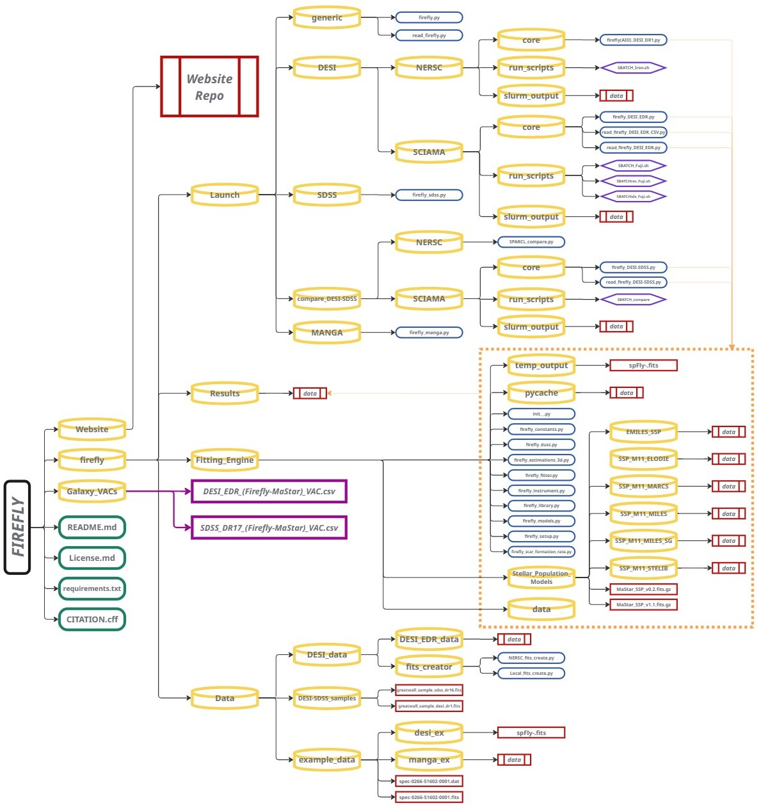

<div align="center">

# FIREFLY - Full Spectral Fitting

|   **F**itting **I**te**R**ativ**E**ly **F**or **L**ikelihood Anal**Y**sis    |

**[📄 Cite](CITATION.cff)** • **[🌐 Website](https://firefly-collaboration.github.io/FIREFLY/)** • **[🔗 Old Release](https://github.com/FireflySpectra/firefly_release)** • **[🚀 Get Started](https://github.com/Firefly-Collaboration/FIREFLY/tree/main/firefly/Launch)**

</div>

---

</div>

<div align="center">


</div>

---

<div align="center">

## 📚 Documentation • Tutorials • Examples

[](https://firefly-collaboration.github.io/FIREFLY/)

**For the full experience with interactive features, notebooks and more, visit our website above**

</div>

---

<div align="center">


</div>

---

<div align="center">

## 📖 Table of Contents


| Core Documentation | Advanced Topics |
|---|---|
| • [Overview](#-overview)<br/>• [Key Features](#-key-features)<br/>• [Installation](#-installation)<br/>• [Quick Start](#-quick-start)<br/>• [Usage](#-usage)<br/>• [Repository Structure](#-repository-structure)<br/>• [Stellar Population Models](#-stellar-population-models) | • [Output Products](#-output-products)<br/>• [Value Added Catalogs](#-value-added-catalogs)<br/>• [Citation](#-citation)<br/>• [Contributing](#-contributing)<br/>• [FIREFLY Collaboration](#-firefly-collaboration)<br/>• [License](#-license)<br/>• [Original Release](#-original-release) |

---
</div>
<div align="center">

## 🔭 Overview

</div>

> **FIREFLY is a chi-squared minimization fitting code designed for deriving the stellar population properties of stellar systems from spectroscopic data. Whether analysing the very lastest observed galaxy spectra, samples from huge surveys, or model spectra from simulations, FIREFLY provides a prior-free fitting approach.**

### ⚙️ **How It Works**

- **FIREFLY fits combinations of single-burst stellar population (SSP) models** to spectroscopic data following an iterative best-fitting process controlled by the Bayesian Information Criterion (BIC).

- **No imposed priors:** All solutions within a statistical cut are retained with their weights.

- **No additive or multiplicative polynomials:** Spectral shape is not artificially adjusted.

- **No regularisation:** Maximum fitting freedom to map intrinsic SED degeneracies, such as age, metallicity, dust reddening on stellar population properties.

- **High-Pass Filter (HPF) dust treatment:** Novel procedure for continuum rectification and dust attenuation. The returned attenuation array is then matched to known analytical approximations to return an E(B-V) value. This procedure allows for removal of large scale modes of the spectrum associated with dust and/or poor flux calibration.

### 🎯 **Performance**

- **Comprehensive VACs produced** from a variety of telescopes and different data sources.

- **Extensivley tested** on real galaxy spectra from the Sloan Digital Sky Survey (SDSS).

- **Applied to spectra** from SDSS-IV/MaNGA integral field spectroscopy to analyse millions of galaxies.

- **Upgraded to derive** the stellar population properties of galaxies from the latest Dark Energy Spectroscopic Instrument (DESI) observations.

- **Tested on data** from the DEEP2 survey and Milky Way globular clusters.

- **Robust recovery** down to S/N ~ 5 for moderately dusty systems.

---

<div align="center">


</div>

---

<div align="center">

## ✨ Key Features

</div>

- **Flexible Input:** FIREFLY can be tailored to fit spectra from a variety of different data formats, spectral resolutions and wavelength ranges.
- **Comprehensive Output:** Provides both light and mass weighted stellar population properties including age, metallicity, dust attenuation E(B-V), stellar mass and remnant mass partition (white dwarfs, neutron stars, black holes), star formation rates and histories, and SSP-specific component weights.
- **Multiple Model Libraries:** Support for MaStar (Maraston et al. 2020) and M11 (Maraston & Strömback 2011) stellar population models.
- **Survey Integration:** Dedicated pipelines for DESI, SDSS, and MaNGA data sources.
- **Emission Line Masking:** Configurable masking settings for accurate continuum fitting.
- **Multiple Viable Solutions:** Using the Bayesian Information Criterion (BIC), FIREFLY retains several fits rather than a single best-fit, improving convergence with models and allowing for realistic error estimates on derived parameters.

---

<div align="center">

## 🚀 Installation

</div>

### **Requirements**

```yaml
Python: 3.6+
Core scientific stack:
	- numpy>=2.2.2
	- scipy>=1.15.1
	- pandas>=2.2.3
	- astropy>=7.0.0
	- matplotlib>=3.10.0
Additional packages:
	- fitsio>=1.2.1
	- psutil>=5.9.8
	- requests>=2.32.3
	- tqdm>=4.67.1
NERSC only:
	- desimodel>=0.19.3
	- desispec>=0.69.0
	- desitarget>=2.90
	- sparcl>=1.2.0
```

---

### **Installation Steps**

#### **1️⃣ Clone the repository:**

```bash
git clone https://github.com/Firefly-Collaboration/FIREFLY.git
cd firefly
```

#### **2️⃣ Install Python dependencies:**

```bash
pip install -r requirements.txt
```

#### **3️⃣ Environment Variables (Optional):**

**For bash/zsh (.bashrc or .bash_profile):**

```bash
export FF_DIR='/path/to/FIREFLY'
export PYTHONPATH="${FF_DIR}/firefly/Fitting_Engine:$PYTHONPATH"
export STELLARPOPMODELS_DIR="${FF_DIR}/firefly/Fitting_Engine/stellar_population_models"
```

---

### **Stellar Population Models**

> Stellar population model templates are included in the repository: M11 Models (Maraston & Strömback 2011): MILES, STELIB, ELODIE, MARCS libraries. MaStar Models: High-resolution empirical stellar library. IMF Options: Kroupa and Salpeter initial mass functions. Models are located in: `firefly/Fitting_Engine/stellar_population_models/` and new models can be added to the module providing they are formatted for FIREFLY compatability. To read more about how to implement new models into FIREFLY take a look at the [configuration page](https://firefly-collaboration.github.io/FIREFLY/configuration.html#custom-models).

---

<div align="center">

## ⚡ Quick Start

</div>

```bash
cd firefly/Launch/generic
python firefly.py
```

> **This will fit the example spectrum located in `firefly/Data/example_data/`.**

---

## 📊 Usage

### 📄 **Generic ASCII Input**

1️⃣ Navigate: `cd firefly/Launch/generic`
2️⃣ Edit `firefly.py` to set input_file, redshift, and parameters.
3️⃣ Run: `python firefly.py`
4️⃣ Read output: `python read_firefly.py`

**Input Format:**
> ASCII with wavelength, flux, and error columns.

### 🌌 **SDSS Spectra**

```bash
cd firefly/Launch/SDSS
python firefly_SDSS.py
```

> Edit the script to point to new SDSS spec files; redshift and metadata are read from FITS headers.

### 🔬 **MaNGA Data Cubes**

```bash
cd firefly/Launch/MANGA
python firefly_MANGA.py
```

> Processes MaNGA data cubes and fits Voronoi binned spectra. Configure paths to logcube and DAP files inside the script.

### 🌠 **DESI Spectra**

**NERSC (DESI-DR1):**

The quickest version of FIREFLY, firefly(AIO), can be run on NERSC in the DESI-DR1 example pipleine.

```bash
cd FIREFLY/Launch/DESI/NERSC/run_scripts
sbatch SBATCH_Iron.sh
```

**SCIAMA HPC (DESI-EDR):**

For users who don't have access to NERSC a DESI-EDR example pipeline uses the SCIAMA HPC (Insitute of Cosmology and Gravitation, Portsmouth, UK) but can be easily updated for use on another HPC.

```bash
cd FIREFLY/Launch/DESI/SCIAMA/run_scripts/
sbatch SBATCH_Fuji.sh DESI_EDR_10000-20000.fits
```

---

<div align="center">

### ⚙️ **Configuration Options**

</div>

| Parameter | Options |
|---|---|
| **Stellar Population Models** | `'m11'` or `'MaStar'` |
| **Model Library** | `'MILES'`, `'STELIB'`, `'ELODIE'`, `'MARCS'`, `'gold'` |
| **Initial Mass Function** | `'kr'` (Kroupa) or `'ss'` (Salpeter) |
| **Wavelength Range** | Customise fitting limits |
| **Emission Line Masking** | Enable/disable and specify lines to mask |
| **Dust Treatment** | Configure High-Pass Filter parameters |

> **💡 See the example scripts in `firefly/Launch/` for detailed configuration examples.**

---

<div align="center">

## 📁 Repository Structure

</div>



---

<div align="center">

## 🌟 Stellar Population Models

</div>

### **MaStar Models**

- **v0.2:** Initial release
- **v1.1:** Updated version with improved calibration
- **gold:** Highest quality stellar templates

> MaStar: Maraston et al. 2020 — [ADS](https://ui.adsabs.harvard.edu/abs/2020MNRAS.496.2962M) | [BibTeX](https://ui.adsabs.harvard.edu/abs/2020MNRAS.496.2962M/exportcitation)

---

### **M11 Models**

- **MILES:** Medium resolution (FWHM ~ 2.5Å)
- **STELIB:** Empirical stellar library
- **ELODIE:** High-resolution stellar library
- **MARCS:** Theoretical stellar atmospheres (Kroupa IMF only)

> M11: Maraston & Strömbäck 2011 — [ADS](https://ui.adsabs.harvard.edu/abs/2011MNRAS.418.2785M) | [BibTeX](https://ui.adsabs.harvard.edu/abs/2011MNRAS.418.2785M/exportcitation)

---

### **Available Initial Mass Functions**

- **Kroupa IMF (`'kr'`):** Broken power law IMF (Kroupa 2001)
- **Salpeter IMF (`'ss'`):** Single power law IMF (Salpeter 1955)

---

<div align="center">

## 📤 Output Products

</div>

<div align="center">

### **Header Information**

| **Parameter** | **Description** |
|:-------------|:---------------|
| `stellar_mass` | log(M*/M☉) |
| `age_lightW` | Light-weighted log(age/yr) |
| `age_massW` | Mass-weighted log(age/yr) |
| `metallicity_lightW` | Light-weighted [Z/H] |
| `metallicity_massW` | Light-weighted [Z/H] |
| `EBV` | Dust attenuation E(B-V) in magnitudes |
| `ssp_number` | Number of SSP components in best fit |
| Individual SSP properties | `log_age_ssp_X`, `metal_ssp_X`, `weightLight_ssp_X`, `weightMass_ssp_X` |

</div>
---

### **Reading Output**

#### **Load FIREFLY output:**

```python
from astropy.io import fits
import numpy as np

hdul = fits.open('output_file.fits')
data = hdul[1].data
```

---

#### **Extract best-fit parameters:**

```python
wave  = data['wavelength']
flux  = data['original_data']
model = data['firefly_model']

stellar_mass = hdul[1].header['stellar_mass']
age_lightW = hdul[1].header['age_lightW']
metallicity = hdul[1].header['metallicity_lightW']
ebv = hdul[1].header['EBV']
```

---

#### **Display results:**

```python
hdul.info()
hdul.close()

print('Age: ' + str(np.around(10**age_lightW, decimals=2)) + ' Gyr')
print('[Z/H]: ' + str(np.around(metallicity, decimals=2)) + ' dex')
print('log M/M☉: ' + str(np.around(stellar_mass, decimals=2)))
print('E(B-V): ' + str(np.around(ebv, decimals=2)) + ' mag')
```

---

#### **Plot spectrum and best-fit model:**

```python
import matplotlib.pyplot as plt

plt.plot(wave, flux, label='Observed Spectrum')
plt.plot(wave, model, label='FIREFLY Model')
plt.xlabel('Wavelength')
plt.ylabel('Flux')
plt.legend()
plt.show()
```

---

<div align="center">

## 📊 Value Added Catalogs

</div>

> The `Galaxy_VACs/` directory is designed to store store just some Value Added Catalogs (VACs) created with FIREFLY for large galaxy surveys. Presented in various formats, these catalogs contain stellar population properties of millions of galaxies derived from a variety of spectroscopic surveys.

> **📝 Note:** The VACs are typically very large files and may be hosted separately.

---

<div align="center">

## 📝 Citation

</div>

> **If you use FIREFLY or its resources for work/research presented in a publication we ask that you please cite the following papers:**

<div align="center">

| Publication | Links |
|---|---|
| **FIREFLY:** Wilkinson et al. 2017 | [ADS](https://ui.adsabs.harvard.edu/abs/2017MNRAS.472.4297W) • [BibTeX](https://ui.adsabs.harvard.edu/abs/2017MNRAS.472.4297W/exportcitation) |
| **FIREFLY (ASCL):** Wilkinson et al. 2021 | [ADS](https://ui.adsabs.harvard.edu/abs/2021ascl.soft08010W) • [BibTeX](https://ui.adsabs.harvard.edu/abs/2021ascl.soft08010W/exportcitation) |
| **FIREFLY:** Neumann et al. 2022 | [ADS](https://ui.adsabs.harvard.edu/abs/2022MNRAS.513.5988N) • [BibTeX](https://ui.adsabs.harvard.edu/abs/2022MNRAS.513.5988N/exportcitation) |
| **MaStar:** Maraston et al. 2020 | [ADS](https://ui.adsabs.harvard.edu/abs/2020MNRAS.496.2962M) • [BibTeX](https://ui.adsabs.harvard.edu/abs/2020MNRAS.496.2962M/exportcitation) |
| **M11:** Maraston & Strömbäck 2011 | [ADS](https://ui.adsabs.harvard.edu/abs/2011MNRAS.418.2785M) • [BibTeX](https://ui.adsabs.harvard.edu/abs/2011MNRAS.418.2785M/exportcitation) |

**📄 A BibTeX file is provided in [CITATION.cff](CITATION.cff) for your convenience.**

</div>
---

<div align="center">

## 🤝 Contributing

</div>

> **We welcome contributions to FIREFLY! Whether you're fixing bugs, adding new features, or improving documentation, your help is appreciated. If you fit spectra from a new survey with FIREFLY, adding the new pipeline to the project with help future users.**

### **How to Contribute**

#### **1️⃣ Fork the repository**

#### **2️⃣ Create a feature branch:**
```bash
git checkout -b feature/YourFeature
```
#### **3️⃣ Commit your changes:**
```bash
git commit -m 'Add YourFeature'
```
#### **4️⃣ Push to the branch:**
```bash
git push origin feature/YourFeature
```
#### **5️⃣ Open a Pull Request**


> Please ensure your code follows the existing style and includes appropriate documentation.

---

<div align="center">

## 👥 FIREFLY Collaboration

</div>

<div align="center">

### **Original Module Author**
**David M. Wilkinson** - Core fitting engine development

</div>

<div align="center">

### **Principal Investigators**
**Daniel Thomas**
**Claudia Maraston**

</div>

<div align="center">

### **Website & Repository Developer**
**Samuel Helps**

</div>

<div align="center">

### **Module Contributors**

| Contributor | Role |
|---|---|
| **Daniel Thomas** | Core scripting and SDSS/generic pipelines |
| **Johan Comparat** | Spectral setup utilities and SDSS pipeline |
| **Justus Neumann** | MaNGA pipeline and fitting engine support |
| **Violeta Gonzalez-Perez** | Utilities, dust and models support |
| **Daniel Goddard** | Instrument and MaNGA pipeline support |
| **Sofia Meneses-Goytia** | Estimations, setup and models support |
| **Samuel Helps** | DESI-EDR pipeline and repository development |
| **Kieran Graham** | DESI DR1 (AIO) pipeline |
| **Harry Hicks** | Models module support |
| **Kyle Westfall** | Utilities and MaNGA DAP (constants) integration |
| **Vinnie Sands** | Dust script bug fixes |

### **Institution**

</div>

> **Institute of Cosmology and Gravitation**  
> University of Portsmouth  
> Portsmouth, United Kingdom

---

<div align="center">

## 📜 License

</div>

> This project is licensed under the [**MIT License**](https://opensource.org/licenses/MIT) - see the [LICENSE.md](LICENSE.md) file for details.
>
> Unless otherwise specified, media content is licensed under [**CC BY 4.0**](https://creativecommons.org/licenses/by/4.0/).

---

<div align="center">

## 🔗 Original Release

</div>

> This new release of FIREFLY is based on the original repository. To explore the old github, visit: 
>
> **https://github.com/FireflySpectra/firefly_release**

---

<div align="center">

### ⚠️ **Disclaimer**

> **FIREFLY is provided as-is for academic purposes. The FIREFLY Collaboration assumes no liability for misuse of this software, website, media content, or any outputs generated by this code. While extensively tested, users are responsible for validating results for their specific applications.**

---

</div>
